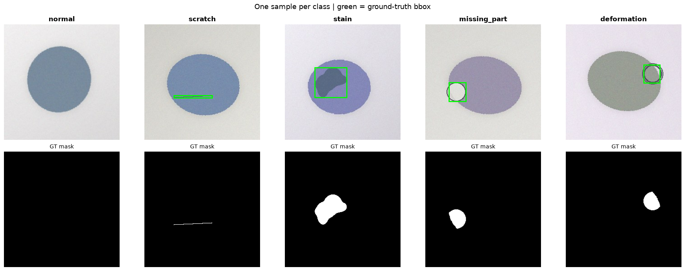
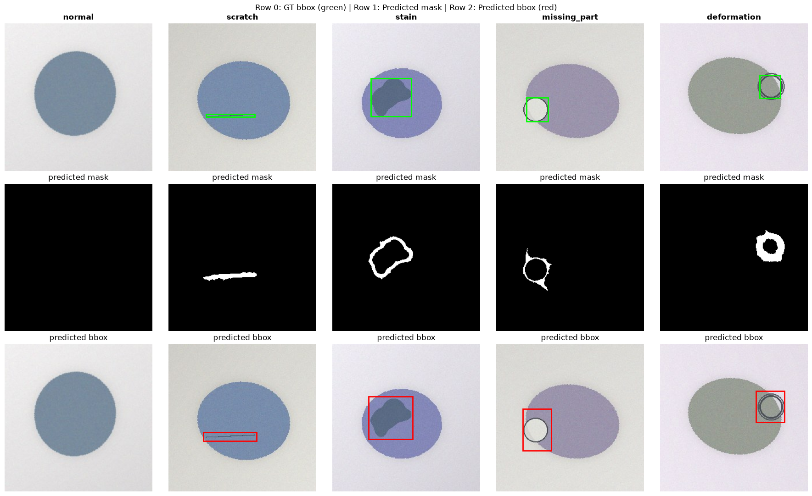
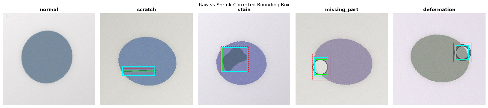
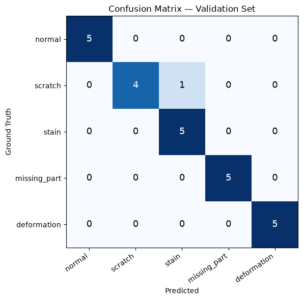

# Industrial Defect Detection — Classical Computer Vision

Automated defect classification and localization for a mini industrial
quality-control pipeline, using classical computer vision (OpenCV) and a
Random Forest classifier — **no deep learning required**.

Given a single 256×256 product image, the system predicts:
- **which defect class** it belongs to (`normal`, `scratch`, `stain`, `missing_part`, `deformation`)
- **where** the defect is located (bounding box)

---

## Results

| Metric    | Validation | Test (hidden) |
|-----------|:----------:|:--------------:|
| Macro F1  | 0.96       | 0.97           |
| Mean IoU  | 0.72       | 0.74           |
| Accuracy  | 0.96       | 0.97           |
| **Final** | **0.90**   | **0.91**       |

*Final score = 0.65 × Macro-F1 + 0.25 × Mean-IoU + 0.10 × Accuracy*

### Sample Predictions


*One example per class, with ground-truth bounding box (green) and defect mask.*


*Raw defect segmentation output before bbox correction.*


*Raw prediction (red, dashed) vs ground truth (green) vs shrink-corrected prediction (cyan).*


*Validation set confusion matrix.*

---

## Approach

The dataset is small (75 train images, 5 classes) and synthetic — defects
have clear, consistent visual signatures. This makes classical computer
vision a better fit than deep learning, which would overfit on this little
data. The full reasoning and experiments are in `notebooks/exploration.ipynb`.

### Pipeline

```
Image
  │
  ▼
1. SEGMENTATION (src/segmentation.py)
   Top-Hat + Black-Hat + Canny edges → candidate defect region
  │
  ▼
2. FEATURE EXTRACTION (src/features.py)
   10 numerical features: area, aspect ratio, fill ratio, brightness,
   relative brightness, distance from center, saturation, solidity,
   perimeter ratio, bbox area
  │
  ▼
3. CLASSIFICATION (src/train.py)
   Random Forest (200 trees) trained on the 10 features
  │
  ▼
4. LOCALIZATION (src/predict.py)
   Same segmentation bbox, corrected with a per-class shrink factor
   learned from the train set (raw segmentation tends to over-estimate
   defect size due to blurry transition pixels)
  │
  ▼
Predicted class + bounding box
```

### Why classical CV, not deep learning?

- Only 75 training images (15 per class) — far too little for a CNN to
  generalize; it would simply memorize the training set.
- The dataset is synthetic with very consistent defect signatures
  (color deviation, shape, location), which classical CV features
  capture well.
- A Random Forest on 10 hand-crafted features achieves >0.90 final score
  with no GPU and a few seconds of training time.

### Why a single segmentation method for all classes?

Earlier iterations used class-specific detectors (Hough line transform
for `scratch`, LAB color deviation for `stain`, convex-hull difference
for edge defects). These were tested against a single generic method
(Top-Hat/Black-Hat + Canny + learned shrink correction) on the
validation set:

| Class          | Specific detector IoU | Generic + shrink IoU |
|----------------|:----------------------:|:----------------------:|
| scratch        | 0.164 (Hough)          | **0.356**              |
| missing_part   | 0.759 (convex hull)    | **0.783**               |
| deformation    | 0.000 (convex hull)    | **0.816**               |

The generic method won across the board and is simpler to maintain, so
it was adopted for all classes.

---

## Project Structure

```
defect_detection/
├── src/
│   ├── config.py          # paths, constants, hyperparameters
│   ├── segmentation.py    # defect region detection
│   ├── features.py        # feature extraction (10-dim vector)
│   ├── train.py           # Random Forest training + validation
│   └── predict.py         # submission generation + test evaluation
├── notebooks/
│   └── exploration.ipynb  # EDA, visualizations, method comparisons
├── outputs/                # generated plots, trained model, submission.csv
├── requirements.txt
└── README.md
```

---

## Setup

```bash
# Clone the repository
git clone https://github.com/serdararici/opencv-defect-detection.git
cd opencv-defect-detection

# Create and activate a virtual environment
python -m venv .venv
.venv\Scripts\activate        # Windows
# source .venv/bin/activate   # macOS/Linux

# Install dependencies
pip install -r requirements.txt
```

**Note:** the dataset (`train/`, `val/`, `test_hidden/`) is expected one
directory above this project, i.e. `../train`, `../val`, `../test_hidden`
relative to `defect_detection/`. Adjust paths in `src/config.py` if your
layout differs.

---

## Usage

```bash
# 1. Train the classifier and evaluate on the validation set
python -m src.train

# 2. Generate predictions for the test set and evaluate (if labels exist)
python -m src.predict
```

Output files are written to `outputs/`:
- `model.pkl` — trained Random Forest
- `confusion_matrix.png` — validation confusion matrix
- `submission.csv` — final predictions (`image_id, predicted_class, x1, y1, x2, y2`)

---

## License

MIT
